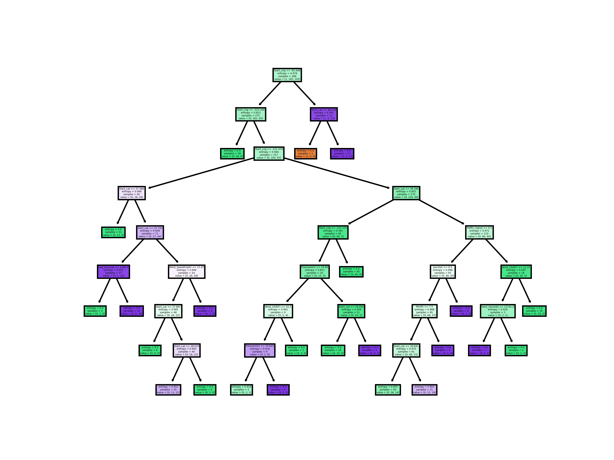
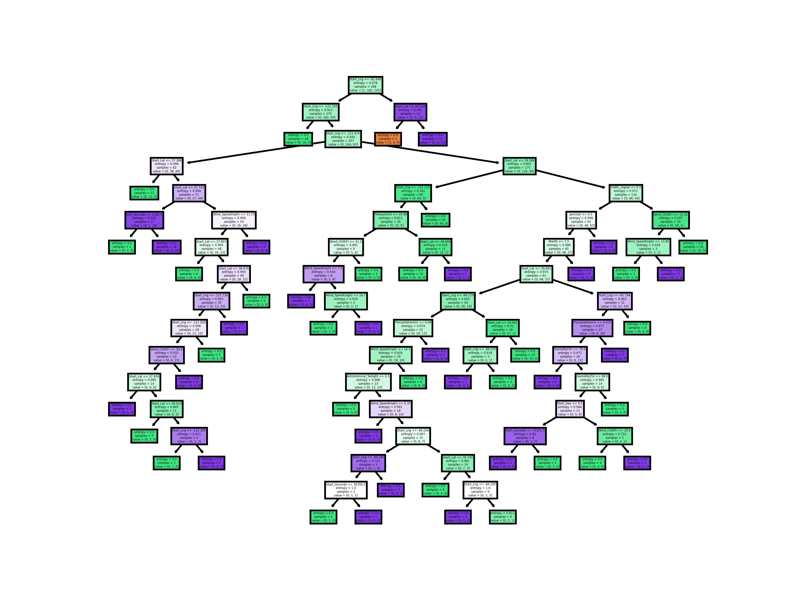
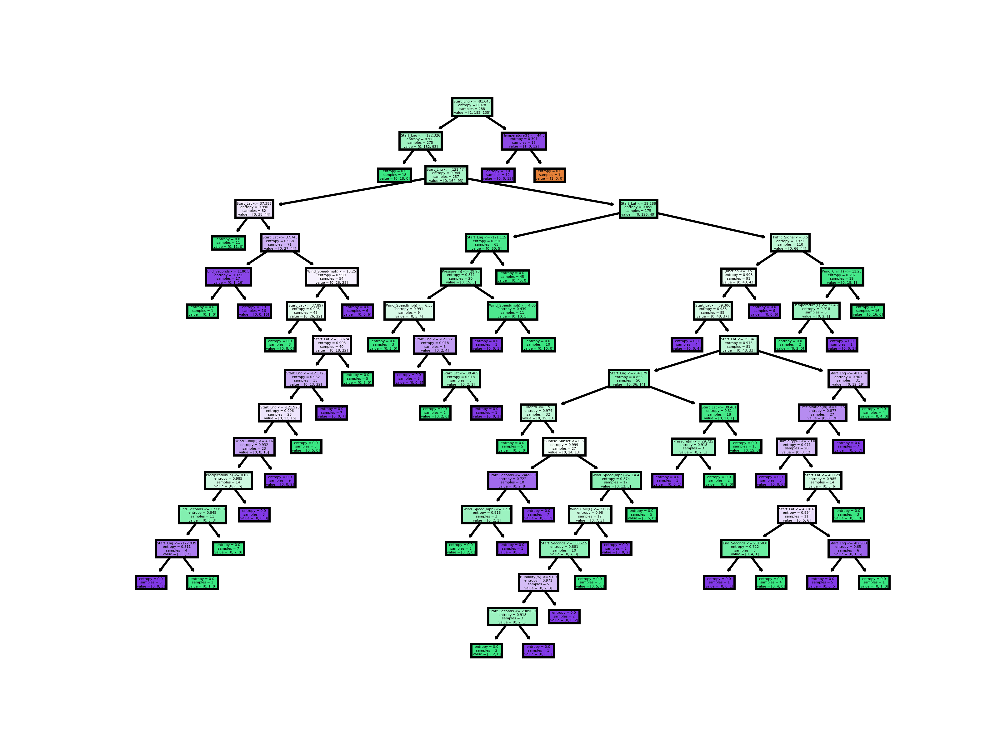
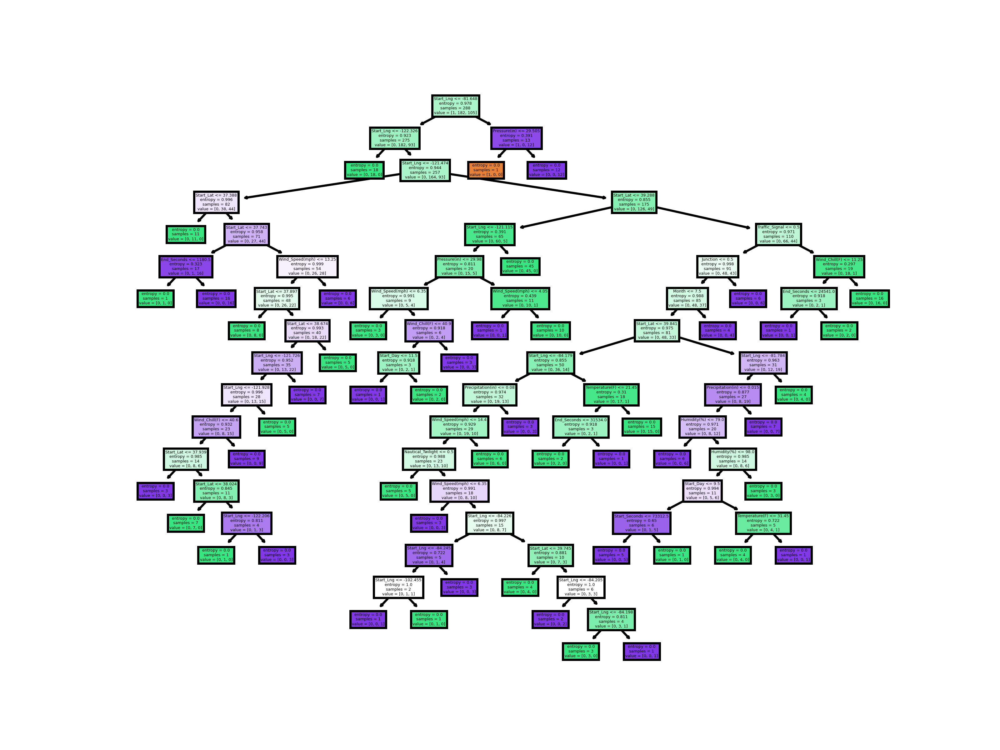

# DecisionTreeReport
## Tree Max Depth 1
### Accuracy Score: 0.589041095890411

## Tree Max Depth 2
### Accuracy Score: 0.589041095890411

## Tree Max Depth 4
### Accuracy Score: 0.7123287671232876

## Tree Max Depth 8
### Accuracy Score: 0.8356164383561644

## Tree Max Depth 16
### Accuracy Score: 0.7808219178082192

## Tree Max Depth 32
### Accuracy Score: 0.7808219178082192

## Tree Max Depth 64
### Accuracy Score: 0.7945205479452054

## Tree Max Depth 128
### Accuracy Score: 0.7945205479452054

## Tree Max Depth 256
### Accuracy Score: 0.8082191780821918

## Tree Max Depth None
### Accuracy Score: 0.7808219178082192

